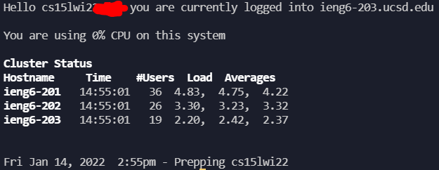
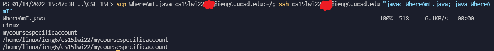

[Back to main](https://dowhep.github.io/cse15l-lab-reports/)

---

# Lab Report 1 - 1/14/2022
THe topic of this lab is **remote access**. 

The instructions can be viewed [here](https://ucsd-cse15l-w22.github.io/week/week1/).

Here is the table of content:

* TOC
{:toc}

## <a name="InstallVScode"> Installing VScode </a>

I went to the [official website](https://code.visualstudio.com/) for the download and installation guide for the Visual Studio Code application. Since I am using a windows system, I used the windows installer.

I have also gone fancy by including a lot of customizations to make the client look good:

Don't you just love the dark blue background color used by this theme?

## <a name="RemoteConnect"> Remotely Connecting </a>

I first installed ssh from [this link](https://docs.microsoft.com/en-us/windows-server/administration/openssh/openssh_install_firstuse). Then, I looked up my course specific account with [this link](https://sdacs.ucsd.edu/~icc/index.php). Then, I opened a terminal in VSCode and typed `ssh mycoursespecificaccount@ieng6.ucsd.edu`. Then, an authentication question poped up asking me whether to trust UCSD server or not. I hopelessly answered yes as there was nothing else to be done. It then asked for my password. My suspicion aroused but I still blindly followed the instruction like a sheep. Luckily, my account was not hacked yet and I was greeted with the following messages:

## <a name="TryCommands"> Trying Some Commands </a>

The instruction instructed me to run some runnable commands. Namely, I ran `ls`, `cd`, `cp`, `cat`, and `yes` (for some reason the last command proved to be disasterous).  

So I-

Boy do we have a lot of students in this class.

## <a name="MoveFilesSCP"> Moving Files with `scp` </a>

Vastly different than a popular laboratory of the same name, this command does not contain or summon anything anomal, fortunately. I used this command to copy files from my laptop to the UCSD server so that I can easily plant a virus in the server /j. 

Anyways, I just copied a harmless .java file to test out the command.

I really *really* do not want my account to get hacked. Bear the giant red dots with me. Consider them accidental ink stains. You know, *image compression error or something*.

## <a name="SetSSHKey"> Setting an SSH Key </a>

Typing a password everytime can be more secure but everyone agrees it sucks and we need something to speed up our workflow. Tada, SSHKey!

Unfortunately, windows user like me needed to follow extra steps to generate a useable SSH key. Thus, I followed [this tutorial](https://docs.microsoft.com/en-us/windows-server/administration/openssh/openssh_keymanagement#user-key-generation) to do that. 

I then uploaded my ssh key to .ssh folder in my account on the UCSD server. And from now on, I forgot my UCSD password without regret! 

*Giant Blue Dot (Line) Join The Game!* 

## <a name="OptimizeRemote"> Optimizing Remote Running </a>
Initially, to make a local edit to a java file and run it on server, I would have to use `scp xxx.java mycoursespecificaccount@ieng6.ucsd.edu:~/` (copy file to server) + `ssh mycoursespecificaccount@ieng6.ucsd.edu` (log in to server) + `javac xxx.java` (compile) + `java xxx` (run) --- that's a lot of typing. 

In this section, I learned I can use `;` to chain commands, and `""` to ensure the commands are in the same environment...

...which resulted in this one line masterpiece that updates a java file from local client to server, compiles it on server, and run it on server!

As a result, everytime I make an edit to a java file, I only have to ``Ctrl+` ``(open command prompt) + `uparrow` (go to last command) + `Enter` (run last command). And kaboom, my edited java file is running the on server! I can see my programs' errors and mistakes (and experience pain) a lot quicker with a total of **3 key strokes**!