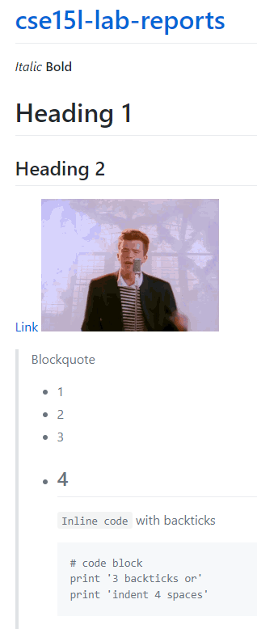
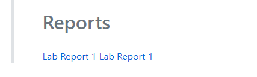
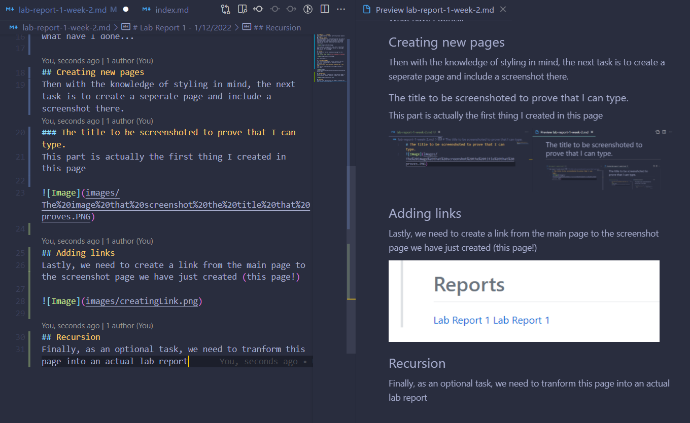
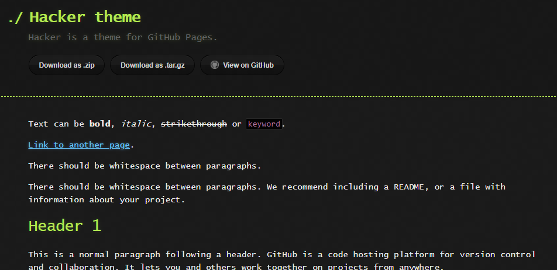

[Back to main](https://dowhep.github.io/cse15l-lab-reports/)

---

# Lab Report 2 - 1/12/2022
This is the lab that created my **first** personal website git repo!
## Creating .md file
What we learned first: by creating a file that end with md (markdown - a text format), github will generate a displayable html file (*does not exist in the github repo*) of the same name to display the markdown file counterpart.

Since index.md will generate index.html - the default page for any website, index.md will be the main page displayed on the github page.

## Styling
We learned some basic styling from the link here:
[.md styling cheat sheet](https://commonmark.org/help/).

Immediately I-

What have I done...

## Creating new pages
Then with the knowledge of styling in mind, the next task is to create a seperate page and include a screenshot there.
### The title to be screenshoted to prove that I can type.
*This part is actually the first thing I created in this page.*

## Adding links
Lastly, we need to create a link from the main page to the screenshot page we have just created (this page!).

uh turns out this is actually the second lab report...

Also the reason there were two links initially is that I was testing out both the absolute link path and the relative link path.

## Recursion
Finally, as an optional task, we need to tranform this page into an actual lab report:

For the process doing this task, 
[goto: Creating .md file](lab-report-2-week-2.html)

## Select Theme

Turns out I can actually select the theme for the github page. Without a doubt, I choose `Hacker Theme`:

>

Kinda cool ngl.

## Some stupid errors:

* VS Code is smart enough to realize .PNG = .png and the .md file preview doesn't treat them differently.
`Error: punchline.png is missing`
* I reorganized the file system for the repo numerous times. I have managed to break at least one link everytime. 

