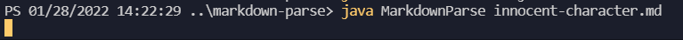
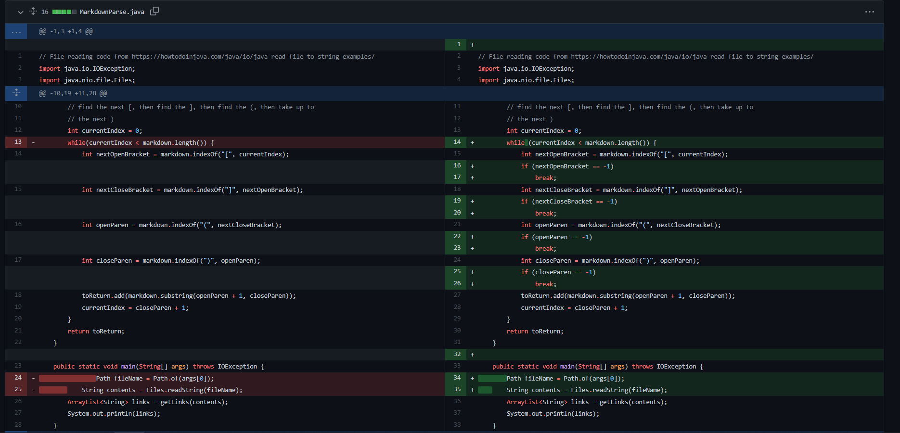
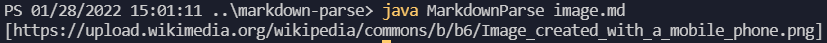
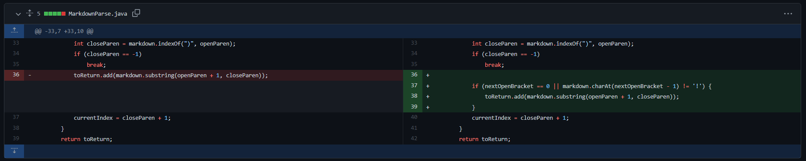
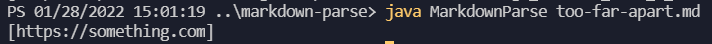
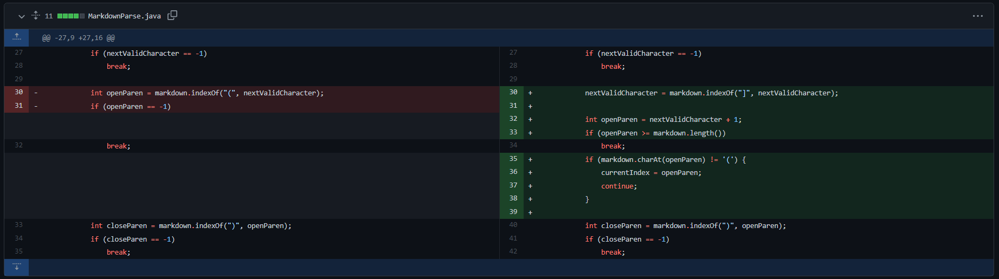

[Back to main](https://dowhep.github.io/cse15l-lab-reports/)

---

# Lab Report 2 - 1/26/2022
The topic of this lab is **Incremental Programming and Debugging**.

The instructions can be viewed [here](https://ucsd-cse15l-w22.github.io/week/week3/).

In this report, I will talk about **3** code changes, each with a corresponding detailed description of the bug, the symptom, and the failure-inducing input.

Here is the table of content:

* [Overview](#Overview)
* [Bug #1](#bug1)
* [Bug #2](#bug2)
* [Bug #3](#bug3)

## <a name="Overview"> Overview </a>

The plan is simple - me and my groupmates are supposed to create a program that identify all links (in the link format) inside a markdown file. In fact, it is even easier since we are given a piece of [starter code](https://github.com/ucsd-cse15l-w22/markdown-parse) that functions correctly for *some* senarios!

> Here is an example of a link format `[test](example.com)` where the program should include "example.com" in its output. 

However, the tricky part is, we do not know in what senario does the code break - it is not easy to figure whether a code is working in all senarios just by inspection.

So here we are, coming up with random test files to break the program and fix it accordingly.

## <a name="bug1"> Bug 1 </a>

After some messing around, we quickly found [this file](https://github.com/dowhep/markdown-parse/blob/main/innocent-character.md) that broke the program.

>
When we ran the above command, the program became unresponsive, most likely reached an infinite loop.

The failure inducing input is literally having some extra characters in the end of a markdown file that is not related to links. Because the ending condition of the program is that the last character of the last link found is the last character of the file, the program would never end if the file does not end with a link, thus reaching an infinite loop.

We quickly fixed it by creating a new end condition: if no part of the link format can be found, then the while loop ends.

>
Above is the code changes we made, viewed in github.

## <a name="bug2"> Bug 2 </a>

We then discussed about whether an image link should be included, such as in [this file](https://github.com/dowhep/markdown-parse/blob/main/image.md). We realized that since the markdown file does not display it as being clickable, it should not be considered as a link, where the program failed to consider.

>
 It is displaying an image but the program believes it is a link.

The failure inducing input is having an image display in the markdown file - the image display format is really similar to the link format. Because there is no check for whether the format the program detected is an image or not, the program treats it as a link by default and output it.

We fixed it by creating a check condition: if an exclamation mark is found before a supposed link (where the link became an image), do not include it in the output

>
Above is the code changes we made, viewed in github.

## <a name="bug3"> Bug 3 </a>

In [this file](https://github.com/dowhep/markdown-parse/blob/main/too-far-apart.md), we discovered that the `]` character of the link format must be next to the `(` character of the format for the format to be valid, where the program also failed to consider.  

>
 Although in the original file the link is not valid, the program still outputs it.  

The failure inducing input is having a link format such that `]` and `(` are not next to each other. Since our program does not check the position of those two character found to see if they are next to each other, the program incorrectly includes the link in the format as a part of the output. 

We fixed it by creating another check condition: if the character following `]` is not `(`, then restart the while loop from this point and discard the current progress of the link format.

>
Above is the code changes we made, viewed in github.
