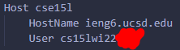
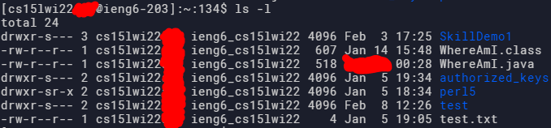

[Back to main](https://dowhep.github.io/cse15l-lab-reports/)

---

# Lab Report 3 - 2/11/2022

For this week, the topic can be choosen from a given range.
I have choosen my topic to be **Streamlining ssh Configuration**.


Here is the table of content:

* [Overview](#Overview)
* [How To Shorten The Necessary Command](#Process)
* [Example of Improved `ssh`](#sshExample)
* [Example of Improved `scp`](#scpExample)


## <a name="Overview"> Overview </a>

Have you ever gotten bored of typing the full address out for sshing everytime?
Have you ever feel like there is a better way to streamline this process?
If you answered "yes" to any of the above questions, then you are lucky because this lab is going to make sshing 1% easier!

## <a name="Process"> How To Shorten The Necessary Command </a>

Now you may ask, how, in any world, do I not need to type out the full address where I am sshing?

So basically, there is a file called `config` in your sshing folder (create it if it does not exist). For windows, this is located at `[current user]\.ssh\config`. And for others, this is probably located at `~/.ssh/config`.

And what you gonna do is add these lines:
```
Host [whatever name]
    HostName [the part of address after "@"]
    User [the part of address before "@"]
```

Then instead of typing out 
```
ssh verylongusername@verylong.host.name
```
you can simply use the host name you put down in the first line to
```
ssh hostname
```
and feel extremely accomplished and geeky.

For example, for me, I set up my ssh command for my CSE 15L course like this:

>Location:
>
>
>
>Just a reminder that the file name must be exactly "config" without any extensions!
>
>Editing with VS Code:
>
>

Now the set up is complete, let's see it in action!

## <a name="sshExample"> Example of Improved `ssh` </a>

>
>
>Feels good when you only need to type short commands for important operations.


## <a name="scpExample"> Example of Improved `scp` </a>

>Copying:
>
>
>
>Result:
>
>
>
>As you can see, the java file has been successfully updated and thus the command succeeded!