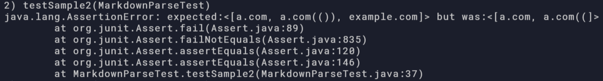
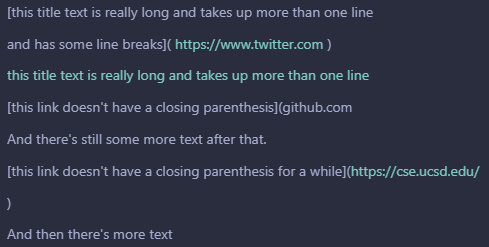

[Back to main](https://dowhep.github.io/cse15l-lab-reports/)

---

# Lab Report 4 - 2/25/2022

In this report, I am going to demonstrate whether our implementation of Markdown
Parse class (a program that detects all valid links in a markdown file) and 
another group's implementation are handling the sample .md files correctly.

Link to the other group's implementation: 
[https://github.com/austin-li/CSE15L-TheLunaMoths](
    https://github.com/austin-li/CSE15L-TheLunaMoths)

Here is the table of content:

* [Test 1](#TestOne)
* [Test 2](#TestTwo)
* [Test 3](#TestThree)
* [Potential Code Changes](#CodeChange)

## <a name="TestOne"> Test 1 </a>

The first snippet of the test is: 
```
`[a link`](url.com)

[another link](`google.com)`

[`cod[e`](google.com)

[`code]`](ucsd.edu)
```

According to Visual Studio Code Preview, it looks like:

>
>
> As you can see, only the last three lines are recognized as links - 
> the expected result from the program should be 
> ``["`google.com", "google.com", "ucsd.edu"]``.

Thus, I built the following test case:

>

Turns out neither of the groups passed the test:

>Our group's result:
>
>
>
>Here, from the second line of the output, you can see that there is an error:
> instead of the expected ``["`google.com", "google.com", __"ucsd.edu"__]``, our 
> program outputted ``[__"url.com"__, "`google.com", "google.com"]``, where the 
> underlined part is the difference.
>
>And the other group's result:
>
>
>
>From the second line of the output, you can see that there is an error:
> instead of the expected ``["`google.com", "google.com", __"ucsd.edu"__]``, 
> their program outputted ``[__"url.com"__, "`google.com", "google.com"]``, 
> where the underlined part is the difference - we had the exact same output.

## <a name="TestTwo"> Test 2 </a>

The second snippet of the test is: 
```
[a [nested link](a.com)](b.com)

[a nested parenthesized url](a.com(()))

[some escaped \[ brackets \]](example.com)
```

According to Visual Studio Code Preview, it looks like:

>
>
> Here, all three lines contain parts that are recognized as links - 
> the expected result from the program should be 
> ``["a.com", "a.com(())", "example.com"]``.

Thus, I built the following test case:

>

Again, neither of the groups passed the test:

>Our group's result:
>
>
>
>Here, from the second line of the output, you can see that there is an error:
> instead of the expected ``["a.com", __"a.com(())", "example.com"__]``, our 
> program outputted ``["a.com", __"a.com(("__]``, where the 
> underlined part is the difference.
>
>And the other group's result:
>
>
>
>From the second line of the output, you can see that there is an error:
> instead of the expected ``["a.com", __"a.com(())", "example.com"__]``, their 
> program outputted ``["a.com", __"a.com(("__]``, where the 
> underlined part is the difference. Interestingly enough, we still have the
> same outputs. What a coincidence! 

## <a name="TestThree"> Test 3 </a>

The third snippet of the test is: 
```
[this title text is really long and takes up more than 
one line

and has some line breaks](
    https://www.twitter.com
)

[this title text is really long and takes up more than 
one line](
    https://ucsd-cse15l-w22.github.io/
)


[this link doesn't have a closing parenthesis](github.com

And there's still some more text after that.

[this link doesn't have a closing parenthesis for a while](https://cse.ucsd.edu/


)

And then there's more text
```

According to Visual Studio Code Preview, it looks like:

>
>
> Only the third line is recognized as a link - 
> the expected result from the program should be 
> ``["https://ucsd-cse15l-w22.github.io/"]``.

Thus, I built the following test case:

>

Neither of the groups passed the test (this is funny because repetition):

>Our group's result:
>
>
>
>Here, from the second line of the output, you can see that there is an error:
> instead of the expected ``["https://ucsd-cse15l-w22.github.io/"]``, our 
> program outputted a long piece of string that, although containing the target
> line, also contain a lot of random information that are not links.
>
>And the other group's result:
>
>
>
>Again, from the second line of the output, you can see that there is an error:
> instead of the expected ``["https://ucsd-cse15l-w22.github.io/"]``, their 
> program outputted an empty list, surprisingly.

## <a name="CodeChange"> Potential Code Changes </a>

Here I discuss whether I think there is a small code change that can make my 
group's program work for snippet 1, 2, and 3.

For snippet 1, I believe so. I simply need to check whether a backtick exist 
for the square bracket part of the link since it does not affect the parenthesis
part. In other words, I can check (two times, before and after the open square
bracket) whether a backtick exists. If it does, the search jump to the next 
backtick.

For snippet 2, I do not think so. The cases that our program failed are quite
different: to fix the code, I need to check for both the case involving nested 
open and close brackets and escaping characters. It would take a couple while
loops to skip the escaping characters already, and I need to make a stack to 
iterate through and account for the nested parenthesis.

For snippet 3, I do think so. To check for the failed cases, I just need to add
a check between index of open bracket and close parenthesis that whether the 
substring `"\n\n"` exists. Discard the link and continue forwards if it does.