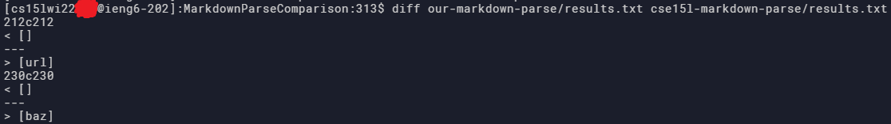
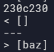
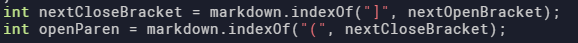
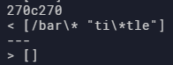
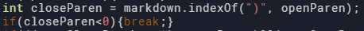

[Back to main](https://dowhep.github.io/cse15l-lab-reports/)

---

# Lab Report 5 - 3/8/2022
{:.no_toc}

In this lab report, I am going to demonstrate the difference between 
our group's Markdown Parse code and the example's by using 
the commonmark-spec tests.
I am specifically including two tests where the two implementations
return different results to talk about which of the two returns the correct one.  

Our group's implementation is here: [https://github.com/Alexander-Kourjanski/markdown-parse](https://github.com/Alexander-Kourjanski/markdown-parse)

The example implementation is here: [https://github.com/Alexander-Kourjanski/markdown-parse](https://github.com/Alexander-Kourjanski/markdown-parse)

Here is the table of content:

* auto-gen TOC
{:toc}

## Find the `diff`-erence

I found the tests with difference result by comparing the outputs of them:
 
> First, I used a simple shell script that loops through all the test files and 
> call the markdown parse on each of the file:
>
> ```
> for file in test-files/*.md;
> do
>     echo $file
>     java MarkdownParse $file
> done
> ```
> That script is stored in the script.sh file.
>
> Then, I used the `>` symbol to redirect the output of each markdown parse to 
> he corresponding `results.txt` file with this command: 
>
> ``` 
> bash script.sh > results.txt
> ``` 
> I ran the script on each of the implementation repositories.
>
> And lastly I used the `diff` command to show the difference between the outputs:
>
>
>
> (There are more differences than just those two...)
## Test 1

The `diff` command shows that there is a difference on line 230 of 
the results.txt files. That correspond to test file 201
from the commonmark-spec tests, which is:
```
[foo]: <bar>(baz)

[foo]
```
### The Difference
In the output of the `diff` command, I found:

> 

The first line represents the line number of difference - 230.

The second and the fourth line represent the output from our implementation 
and the example implementation respectively, which, as you see, are different.

### How to Fix The Bug

According the the preview of VS Code, the output should have been empty (`[]`)
as there is no link present in the file. Thus, our group's implementation is correct.

The bug in the example code is that it did not verify whether the open parenthesis
is next to the close square bracket or not. Since the link is only valid 
if they are close to each other, there should be a verification of 
the relative position of the open parenthesis to the close square bracket after
these lines of code:

>
>
> Snippet of code taken from the MarkdownParse.java provided 
> in the example implementation.

## Test 2

The `diff` command shows that there is a difference on line 270 of 
the results.txt files. That correspond to test file 22
from the commonmark-spec tests, which is:
```
[foo](/bar\* "ti\*tle")
```
### The Difference
In the output of the `diff` command, I found:

> 

The first line represents the line number of difference - 270.

The second and the fourth line represent the output from our implementation 
and the example implementation respectively, which, again, are different.

### How to Fix The Bug

Here, according to the preview of VS Code, the expected output 
should have been `["bar*"]` since the link on the text `foo` points to
the address `bar*`. None of our implementations correctly identified that case.

For our implementation, the bug is that we did not check whether quotation marks
exist inside the open parenthesis or not - apparently, when a link is 
in the format: 
```
[linkname](text1 "text2")
```
`linkname` will be a link that only points to `text1`.

To address that case, we should add code after

>
>
> Snippet of code taken from our impplementation of MarkdownParse.java.

to check whether a pair of quotation marks exist inside the pair of parenthesis,
along with a space that separate the quoted text from the original text.
For example, we can use `markdown.indexOf(" \"", openParen)` to find the position of  
the next quotation mark (if exists) and see if it is between the parenthesis, etc.  